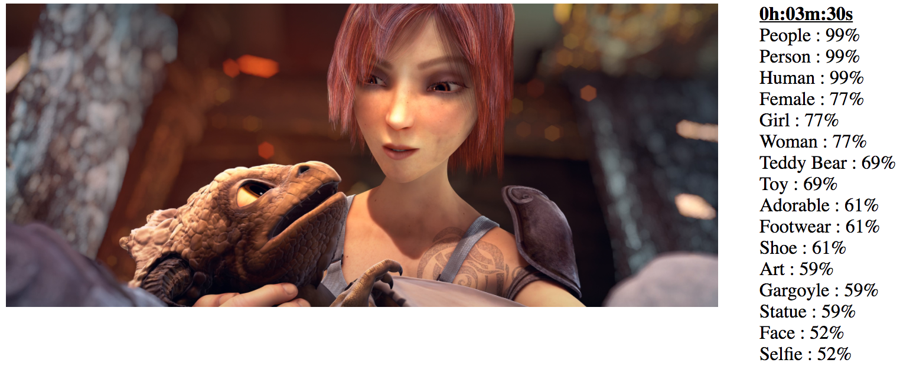

#Video Rekognizer



##About

[Video Rekognizer](https://github.com/BrianEnigma/VideoRekognizer) is a Ruby script that takes a video file, extracts frames as still images, and then sends those to [AWS Rekognition](https://aws.amazon.com/rekognition/). It then compiles the  deep-learning image recognition AI results into a report of thumbnail images and keywords.

The point? Not much. Mostly to show off how well Rekognition works. Or how hilariously it fails, depending on the images.

Video Rekognizer is copyright 2016 by [Brian Enigma](https://netninja.com/about/) and is released under a [Simplified BSD License](LICENSE).

##Requirements

First and foremost, you will need [an AWS account](https://aws.amazon.com/) and an [S3 bucket](https://aws.amazon.com/s3/) set up to receive the image thumbnails. Setting these up is beyond the scope of this document. Also note that some services are not free. At the time of writing this, you can sample S3 free for a year (“Free Usage Tier”) and Rekognition is $1 up to a million images in a given month.

You also need a copy of [ffmpeg](https://ffmpeg.org/download.html) somewhere in the `$PATH`. Video Rekognizer shells out to ffmpeg to perform the heavy-lifting of extracting video frames.

You also need the `aws-sdk` Ruby gem. Depending on your system setup, you can usually automatically install this with `gem install aws-sdk`, perhaps with a `sudo` in front of the command.

##First-Time Setup

Copy `credentials-sample.yml` to `credentials.yml`. This holds information about your AWS account. Edit `credentials.yml` to hold your actual _Access Key ID_, _Secret Access Key_, _region_, and the name of your S3 bucket. The file content looks something like this:

```
access_key_id: AKIAI44QH8DHBEXAMPLE
secret_access_key: je7MtGbClwBF/2Zp9Utk/h3yCo8nvbEXAMPLEKEY
bucket_name: my-sample-bucket
region: us-west-2
```

_**NOTE**_ that the S3 bucket you create should be a **scratch bucket** or a bucket **dedicated** to Video Rekognizer. Each program run, this script will delete files from the bucket that follow the naming pattern `img*.png` — typically the output of a previous run of the script.

##Typical Usage

Once `credentials.yml` has been set up, the typical run of Video Rekognizer looks something like this:

`./videorekognizer.rb --extract-period 30 ~/Movies/Sintel.2010.1080p.mkv`

This takes the Sintel movie and runs Rekognition against video frames extracted at 30-second intervals. 

When the recognition cycle is complete, the output is written to a subfolder called `output`. This includes the thumbnails, an HTML report, and a JSON summary.

##Typical Output

You can find an example output in this project (under the folder named `example`) or online at <https://netninja.com/fun/rekognizer/sintel/>.

##Feature Wishlist

- Better JSON. The current JSON is non-optimal, squishing all recognized values into a single field. It really should be a more complex data structure.
- Better pipelining. Or really, any pipelining. The script acts serially, first extracting video frames. When that is complete, it uploads them. When that is complete, it performs image recognition. A significant portion of the run time of this script is shuffling bytes around. This can be sped up by uploading each frame as it becomes available. It can then be further sped up by performing image recognition on an image as soon as it has uploaded to S3.

